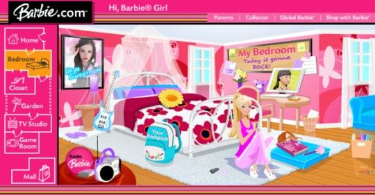
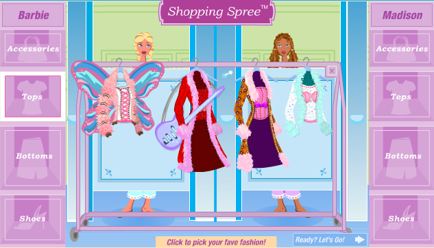

# Advanced Digital Art Assignment 3
> You're so damn electrocute!
>
>   -- Janelle Monae, I Got The Juice

This repo contains an [a-frame](https://aframe.io/) webVR project. It is for an assignment in Prof. Aly Ogasian's Advanced Digital Art class at Scripps College.

## [>>View Deployment Here<<](http://juliaslohman.github.io/electrocute)
(Best viewed in Chrome, if sound does not play, please refresh)

## Assignment Description
> In this assignment, you will explore how digital media can be used to extend, augment, or distort our understanding of time, space and place.
>
> I would like you to create a webVR space that  functions as a window into an “in-between” territory. It may be useful to think about what it means to exist in between physical and virtual space. Is it possible to exist in a fully offline or physical state? What does it mean to be stuck between physical and digital space? Other words to consider: borderline, fringe, peripheral, liminal.
>
> Think about how your space functions. Is it based upon a real place?
>
> How do you define territory? A territory can be macroscopic, microscopic, it can be the size of your bedroom, etc.
>
> How do we navigate and move through your space? How many dimensions does your space have?
>
> How does time function?
>
> How does sound function?

## Artist Statement
'Electrocute' is inspired by early-2000s girls' toys sites like Barbie.com and PollyPocket.com, and what they taught me about what it means to be a girl in the age of the internet. The project also incorporates inspirations from contemporary womxn musicians that engage with egirl aesthetics or cyberfeminism, like Doja Cat, Janelle Monae, and Sarah Bonito. The environment of Electrocute is simultaneously nostalgic and futuristic, and completely feminine.

